# 🏗️ Architecture Diagram

## System Architecture Overview

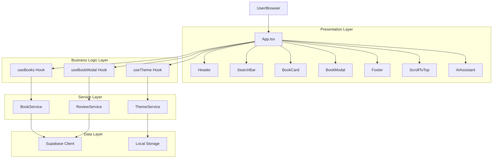

## Data Flow Architecture

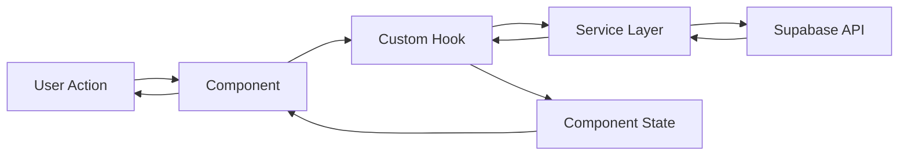

## Component Architecture

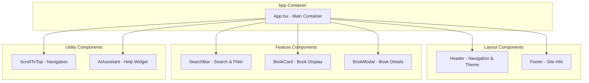

## Hook Dependencies

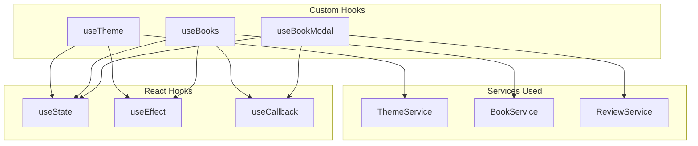

## Service Layer Structure

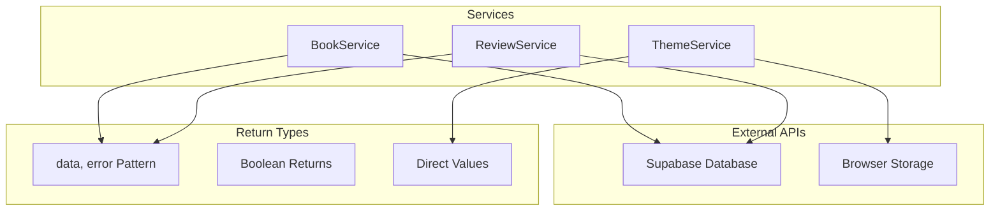

## State Management Flow

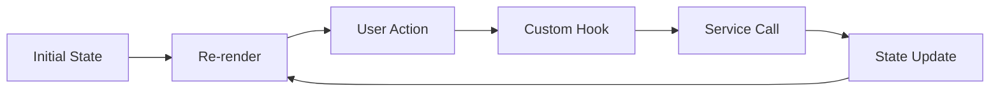

## Theme System Flow

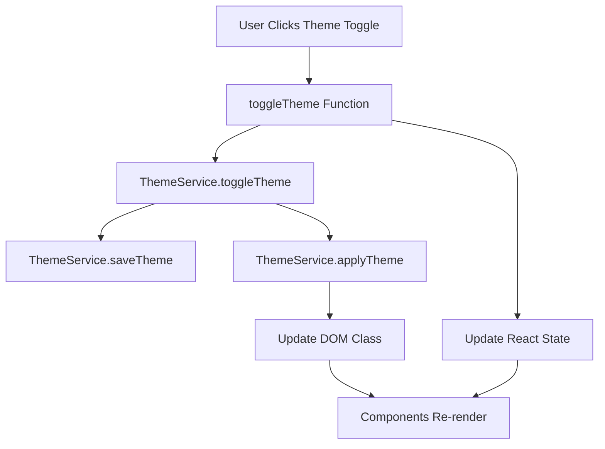

## Book Loading Flow

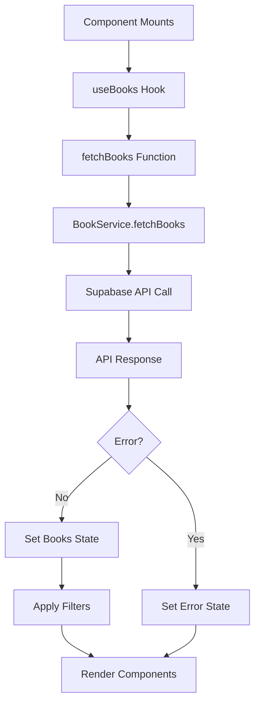

## Folder Structure Visualization

```
src/
├── 📱 components/          (Presentation Layer)
│   ├── Header.tsx         → Layout
│   ├── Footer.tsx         → Layout
│   ├── SearchBar.tsx      → Feature
│   ├── BookCard.tsx       → Feature
│   ├── BookModal.tsx      → Feature
│   ├── ScrollToTop.tsx    → Utility
│   └── AIAssistant.tsx    → Utility
│
├── 🎣 hooks/              (Business Logic Layer)
│   ├── useTheme.ts        → Theme management
│   ├── useBooks.ts        → Book data management
│   ├── useBookModal.ts    → Modal state management
│   └── index.ts           → Exports
│
├── ⚙️ services/           (Service Layer)
│   ├── bookService.ts     → Book operations
│   ├── reviewService.ts   → Review operations
│   ├── themeService.ts    → Theme operations
│   └── index.ts           → Exports
│
├── 🛠️ utils/              (Utility Layer)
│   ├── helpers.ts         → Helper functions
│   └── index.ts           → Exports
│
├── 📋 constants/          (Configuration Layer)
│   └── index.ts           → App constants
│
├── 🔌 lib/                (External Libraries)
│   └── supabase.ts        → Database client
│
├── 📝 types.ts            (Type Definitions)
├── 🎨 App.tsx             (Main Application)
├── 🚀 main.tsx            (Entry Point)
└── 💅 index.css           (Global Styles)
```

## Technology Stack Layers

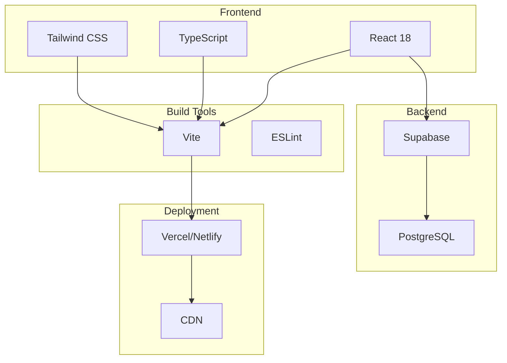

## Request/Response Flow

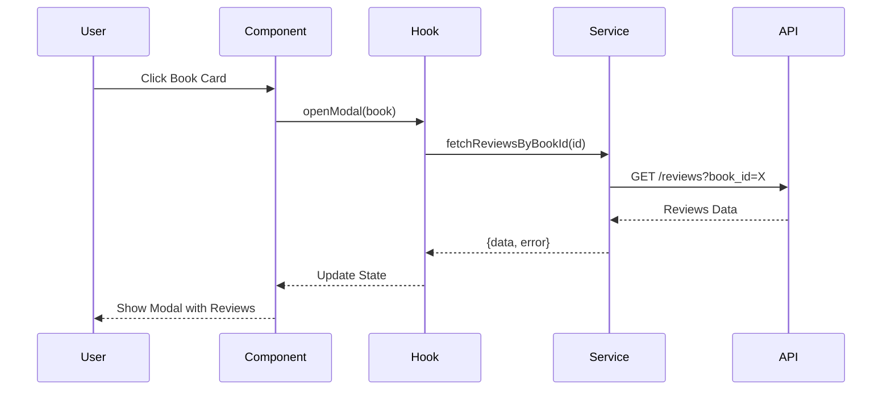

## Error Handling Flow

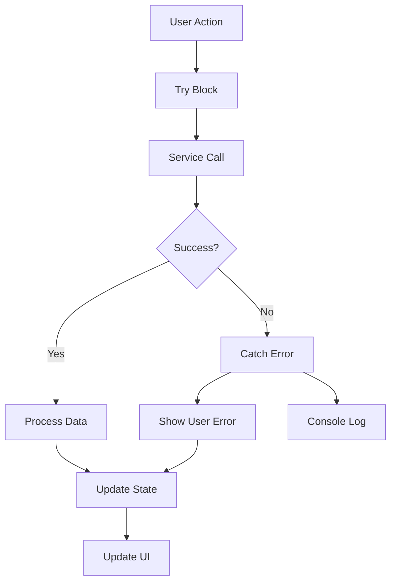

---

## Key Architecture Principles

### 1. Separation of Concerns
- **Components**: Only UI rendering
- **Hooks**: State and side effects
- **Services**: Business logic and API
- **Utils**: Reusable functions

### 2. Unidirectional Data Flow
```
User Action → Component → Hook → Service → API
                  ↑                        ↓
                  └──── State Update ←─────┘
```

### 3. Dependency Injection
- Services are independent
- Hooks consume services
- Components consume hooks

### 4. Single Responsibility
- Each module has one job
- Easy to test and maintain
- Clear boundaries

---

**This architecture ensures**:
✅ Maintainability  
✅ Scalability  
✅ Testability  
✅ Performance  
✅ Developer Experience
