# Open Library Integration Architecture

## System Architecture Diagram

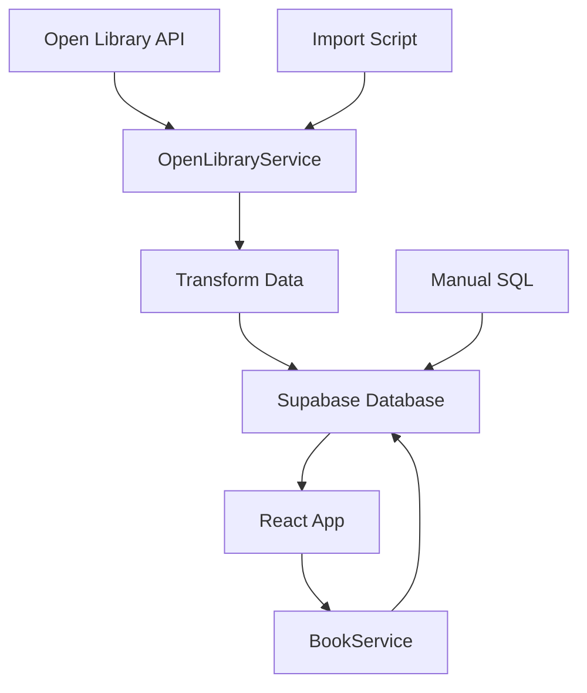

## Data Flow Diagram

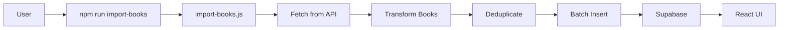

## Service Layer Integration

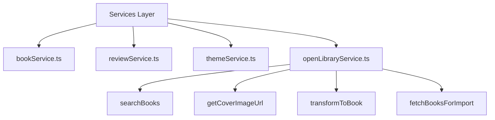

## Import Process Flow

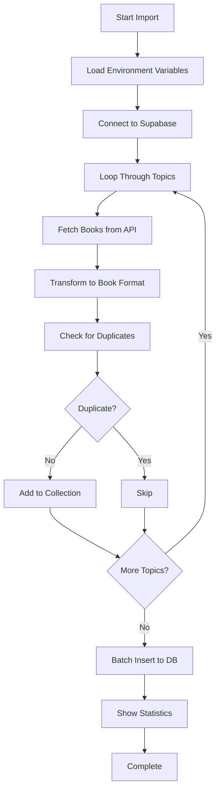

## Category Detection Logic

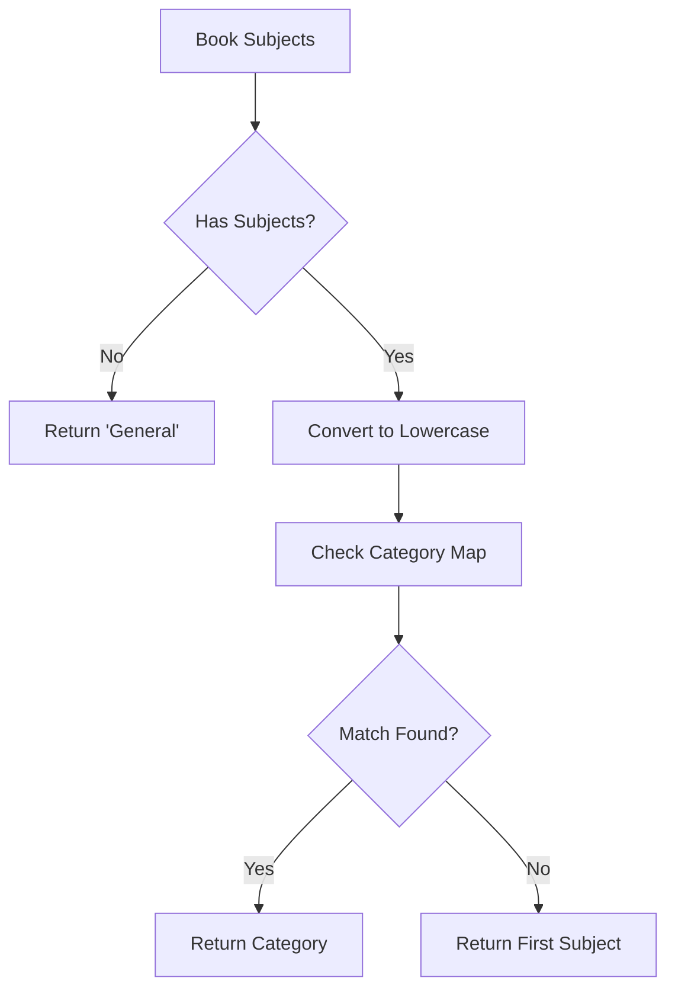

## File Structure

```
kitapKesif/
├── src/
│   ├── services/
│   │   ├── bookService.ts
│   │   ├── reviewService.ts
│   │   ├── themeService.ts
│   │   ├── openLibraryService.ts ← NEW
│   │   └── index.ts (updated)
│   └── ...
├── scripts/
│   ├── add-reviews.js
│   ├── import-books.js ← NEW
│   └── test-open-library.js ← NEW
├── supabase/
│   └── migrations/
│       ├── 20251011080112_create_books_and_reviews_schema.sql
│       ├── 20251015000000_add_diverse_realistic_reviews.sql
│       └── 20251016000000_import_open_library_books.sql ← NEW
├── OPEN_LIBRARY_INTEGRATION.md ← NEW
├── IMPLEMENTATION_SUMMARY.md ← NEW
└── package.json (updated)
```

## API Integration Points

### 1. Search Endpoint
```
https://openlibrary.org/search.json
Parameters:
  - q: search query
  - limit: number of results
```

### 2. Cover Images
```
https://covers.openlibrary.org/b/isbn/{ISBN}-{size}.jpg
https://covers.openlibrary.org/b/id/{cover_id}-{size}.jpg
Sizes: S, M, L
```

## Database Schema

```
books table:
├── id (uuid, PK)
├── title (text)
├── author (text)
├── description (text)
├── cover_image (text)
├── back_cover_image (text, nullable)
├── category (text)
├── average_rating (numeric)
├── total_reviews (integer)
└── created_at (timestamptz)
```

## Component Interaction

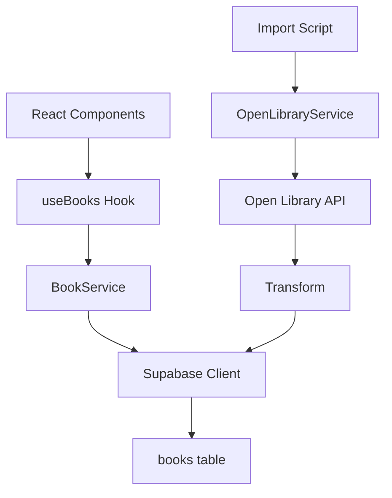

## Error Handling Flow

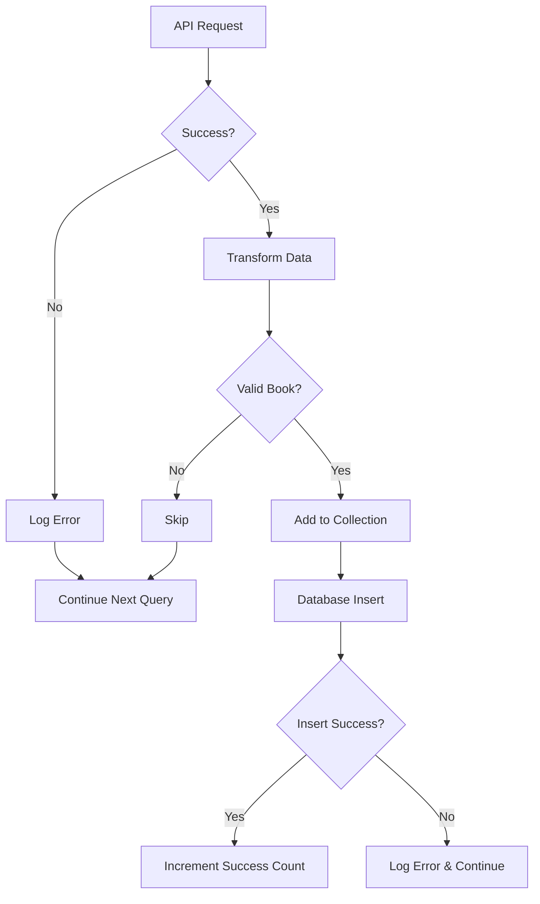

## Rate Limiting Strategy

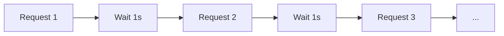

## Batch Processing

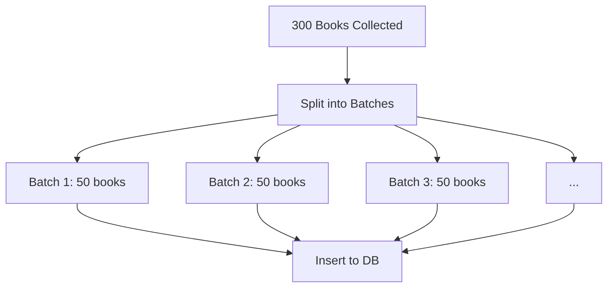

## Usage Scenarios

### Scenario 1: Automated Import
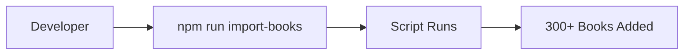

### Scenario 2: Manual SQL
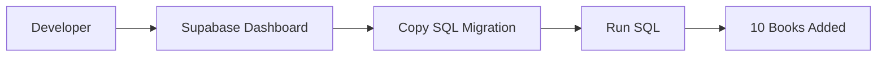

### Scenario 3: Programmatic Use
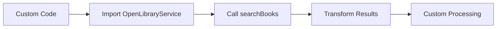

## Technology Stack

```
Frontend:
├── React 18
├── TypeScript
├── Tailwind CSS
└── Vite

Backend:
├── Supabase (PostgreSQL)
└── Node.js (Scripts)

External APIs:
└── Open Library API

Data Format:
├── JSON (API)
└── SQL (Database)
```

---

This architecture provides:
- ✅ **Scalability:** Easy to add more data sources
- ✅ **Maintainability:** Clear separation of concerns
- ✅ **Testability:** Each component can be tested independently
- ✅ **Extensibility:** Easy to add new features
- ✅ **Type Safety:** Full TypeScript support
